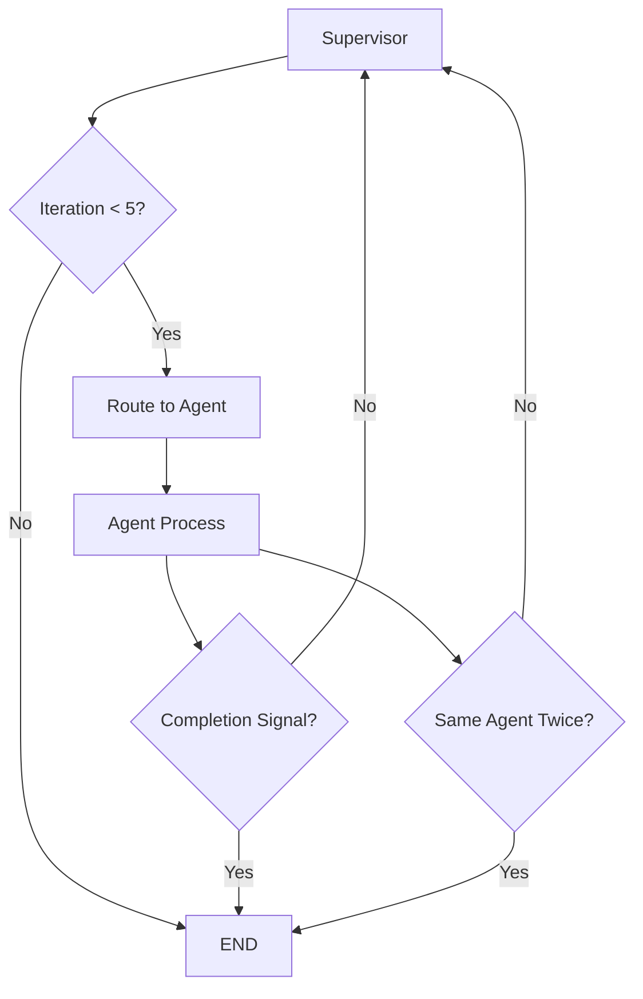

# Architectural Fixes for Infinite Loop Between Supervisor and Explainer

## Problem Analysis

The infinite loop occurs because:
1. Supervisor routes to Explainer for explanation tasks
2. Explainer provides output and returns to Supervisor
3. Supervisor may route back to Explainer if it deems the explanation insufficient or needs more details
4. This creates a cycle with no termination condition

## Proposed Fixes

### 1. Add Loop Prevention State Variables

**Code Changes in `graph.py`:**

```python
class AgentState(TypedDict):
    messages: Annotated[Sequence[BaseMessage], operator.add]
    routes: list[str]
    synthesis: str
    documents: list[str]
    iteration_count: int  # New: Track total iterations
    routing_history: list[str]  # New: Track agent sequence
```

Initialize in `app.py`:
```python
state = {
    "messages": [HumanMessage(content=args.query)],
    "documents": [],
    "routes": [],
    "synthesis": "",
    "iteration_count": 0,  # Initialize
    "routing_history": [],  # Initialize
}
```

### 2. Modify Supervisor Prompt for Completion Awareness

**Update `ROUTER_PROMPT` in `graph.py`:**

```python
ROUTER_PROMPT = SUPERVISOR_PROMPT + """
You classify the query and route to appropriate agents by calling the route_to_* tools.

You can call multiple route_to_* tools in parallel if multiple agents are relevant (e.g., econpaper and econquant for a query needing both research and calculation).

After agents complete their work (you will see their output messages in subsequent invocations), you can route to more agents or provide a final synthesis by responding without tool calls (FINISH).

**LOOP PREVENTION:** If iteration_count >= 3 or if you've routed to the same agent twice in routing_history, provide final synthesis instead of routing.

**COMPLETION SIGNALS:** Look for phrases like "This completes the explanation" or "Final answer:" in agent outputs to determine when to finish.

Use the sequential_thinking tool for planning routes, analysis, or synthesis.

Routing triggers (call the corresponding tool):
- route_to_econpaper: paper, NBER, research
- route_to_econquant: Quant tasks (HHI, UPP, simulations, math, calculations)
- route_to_explainer: explain, caveats, model derivations
- route_to_marketdef: market definition, SSNIP
- route_to_docanalyzer: analyze document, uploads (if documents in state)
- route_to_caselaw: case law, precedent
- route_to_debate: debate, pro/con arguments

If documents are present in the state, prioritize docanalyzer.
Synthesize a final comprehensive answer when routing is complete."""
```

### 3. Update Supervisor Node Logic

**Modify `supervisor_node` in `graph.py`:**

```python
def supervisor_node(state: AgentState) -> dict:
    try:
        result = supervisor_router.invoke({"messages": state["messages"]})
        messages = result["messages"]
        routes = []
        for msg in messages:
            if isinstance(msg, AIMessage) and hasattr(msg, "tool_calls") and msg.tool_calls:
                for tc in msg.tool_calls:
                    if tc["name"].startswith("route_to_"):
                        routes.append(parse_route_tool(tc["name"]))
        routes = list(set(routes))  # unique

        # Loop prevention logic
        current_iteration = state.get("iteration_count", 0) + 1
        routing_history = state.get("routing_history", []) + routes

        # Check for loops
        if current_iteration >= 5:  # Hard limit
            routes = []
        elif len([h for h in routing_history if h in routes]) > 1:  # Same agent twice
            routes = []

        logger.info(f"Node supervisor complete, routes: {routes}, iteration: {current_iteration}")
        return {
            "messages": operator.add(state["messages"], messages),
            "routes": routes,
            "iteration_count": current_iteration,
            "routing_history": routing_history
        }
    except Exception as e:
        logger.error(f"Error in supervisor: {e}")
        return {"messages": [SystemMessage(content=f"Error in supervisor: {e}. Reflect: retry or caveats.")]}
```

### 4. Update Explainer Prompt for Completion Signals

**Modify `EXPLAINER_PROMPT` in `agents/agents.py`:**

```python
EXPLAINER_PROMPT = """You are Explainer Agent: IO educator. Think sequentially/harder; formulate caveats hypotheses. Derive step-by-step with LaTeX; highlight caveats (e.g., "IIA fails here"). Adaptive: plain for boomers, technical for zoomers. Use sequentialthinking for deep hypothesis testing; run_code_py for verifications. Audit LaTeX per rules.

**COMPLETION:** Always end your response with "This completes the explanation." when finished, or "Final answer:" for conclusions."""
```

### 5. Update Route Supervisor Function

**Modify `route_supervisor` in `graph.py`:**

```python
def route_supervisor(state):
    routes = state.get("routes", [])
    iteration_count = state.get("iteration_count", 0)
    routing_history = state.get("routing_history", [])

    if routes:
        # Check if routing to same agent repeatedly
        if any(routing_history.count(route) > 1 for route in routes):
            return END
        return routes[0]  # Single route for conditional; extend to parallel if needed

    # If no routes and high iteration count, force end
    if iteration_count >= 3:
        return END

    route_data = parse_supervisor_output(state)
    if should_force_debate(route_data):
        return "debate"
    route = route_data.get("route", "END")
    if route in ["END", "__end__"]:
        return END
    return agent_map.get(route, "supervisor")
```

### 6. Update Agent Nodes to Increment Counters

**Modify `create_agent_node` in `graph.py`:**

```python
def create_agent_node(agent_name: str):
    def node(state: AgentState) -> dict:
        try:
            result = agents[agent_name].invoke({"messages": state["messages"]})
            logger.info(f"Node {agent_name} complete")
            return {
                "messages": result["messages"],
                "iteration_count": state.get("iteration_count", 0) + 1,
                "routing_history": state.get("routing_history", []) + [agent_name]
            }
        except Exception as e:
            logger.error(f"Error in {agent_name}: {e}")
            return {"messages": [SystemMessage(content=f"Error in {agent_name}: {e}. Reflect: retry or caveats.")]}
    return node
```

## Workflow Diagram



## Testing Recommendations

1. Test with queries that trigger explainer routing
2. Monitor iteration_count and routing_history in logs
3. Verify that loops are broken after 3-5 iterations
4. Check that completion signals are properly detected

## Alternative Approaches

1. **Timeout Mechanism:** Add time-based limits instead of iteration counts
2. **Confidence Scoring:** Supervisor provides confidence score, end when confidence > 0.8
3. **Explicit Finish Tool:** Add a "finish_task" tool for agents to signal completion
4. **State Machine:** More formal state transitions with explicit completion states